# Technical Design Document (TDD)

## IP Address Management System

**Document Version:** 1.0  
**Date:** 2026-02-01  
**Author:** Designer (T1)  
**Status:** Complete  
**Related Documents:**
- [Project Scope](./project_scope.md)
- [Risk Register](./risk_register.md)
- [Module Plan](./ip_management_system_plan.md)
- [Implementation Plan](./implementation_plan.md)
- [Communication Plan](./communication_plan.md)

---

## Table of Contents

1. [Introduction & Goals](#1-introduction--goals-arc42-section-1)
2. [Architecture Constraints](#2-architecture-constraints-arc42-section-2)
3. [System Scope & Context](#3-system-scope--context-arc42-section-3--c4-level-1)
4. [Solution Strategy](#4-solution-strategy-arc42-section-4)
5. [Building Block View](#5-building-block-view-arc42-section-5--c4-level-2-3)
6. [Runtime View](#6-runtime-view-arc42-section-6)
7. [Deployment View](#7-deployment-view-arc42-section-7)
8. [Data View](#8-data-view-arc42-section-8)
9. [Cross-cutting Concepts](#9-cross-cutting-concepts-arc42-section-8)
10. [Architecture Decisions](#10-architecture-decisions-arc42-section-9)
11. [Quality Requirements](#11-quality-requirements-arc42-section-10)
12. [Risks & Technical Debt](#12-risks--technical-debt-arc42-section-11)
13. [Glossary](#13-glossary-arc42-section-12)

---

## 1. Introduction & Goals (arc42 Section 1)

### 1.1 Requirements Overview

The IP Address Management System is a comprehensive full-stack application designed to demonstrate mastery of modern web development practices, microservices architecture, and secure authentication patterns. This system serves as a practical test for senior full-stack developer capabilities.

**Primary Requirements (from [Project Scope](./project_scope.md)):**

| ID | Requirement | Priority | Traceability |
|----|-------------|----------|--------------|
| FR-001 | Implement 3 independent Laravel microservices (Gateway, Auth, IP Management) | High | IPMS-1.1 to IPMS-1.6 |
| FR-002 | JWT-based authentication with automatic token refresh | High | IPMS-2.3, IPMS-4.6 |
| FR-003 | Role-based access control (regular user vs super_admin) | High | IPMS-2.4, IPMS-3.4 |
| FR-004 | IP address CRUD with IPv4/IPv6 validation | High | IPMS-3.3 |
| FR-005 | Comprehensive audit logging for all operations | High | IPMS-2.5, IPMS-3.5 |
| FR-006 | Vue 3 + TypeScript frontend with Pinia state management | High | IPMS-4.4 to IPMS-5.8 |
| FR-007 | Docker containerization with Docker Compose orchestration | High | IPMS-1.5, IPMS-5.6 |

### 1.2 Quality Goals

**Quality Goals derived from NFRs ([Project Scope Section 7](./project_scope.md#7-non-functional-requirements-nfrs)):**

| Priority | Quality Goal | NFR Reference | Architecture Approach |
|----------|--------------|---------------|---------------------|
| 1 | **Security** | SEC-001 to SEC-007 | JWT with bcrypt, Redis token storage, CORS, immutable audit logs |
| 2 | **Maintainability** | MAINT-001 to MAINT-005 | PSR standards, TypeScript strict mode, separation of concerns |
| 3 | **Performance** | PERF-001 to PERF-003 | <200ms API responses, optimized Docker builds, Redis caching |
| 4 | **Usability** | USAB-001 to USAB-005 | Responsive design, toast notifications, form validation |

---

## 2. Architecture Constraints (arc42 Section 2)

### 2.1 Technical Constraints

| Constraint | Description | Rationale |
|------------|-------------|-----------|
| **TC-001** | Laravel 11 for all backend services | Standardized framework across microservices |
| **TC-002** | Vue 3 with TypeScript for frontend | Modern reactive framework with type safety |
| **TC-003** | MySQL 8.0 for databases | Relational data consistency requirements |
| **TC-004** | JWT for authentication | Stateless, scalable authentication mechanism |
| **TC-005** | Docker Compose for orchestration | Simplified local development and deployment |
| **TC-006** | UUIDs for all primary keys | Distributed system compatibility |
| **TC-007** | Separate databases per service | Microservices data isolation principle |

### 2.2 Organizational Constraints

| Constraint | Description | Impact |
|------------|-------------|--------|
| **OC-001** | 5-day accelerated timeline | Requires MVP focus, strict prioritization (RISK-001) |
| **OC-002** | Single developer implementation | Limits parallel work streams |
| **OC-003** | Local development environment only | No production deployment requirements |
| **OC-004** | 20+ meaningful Git commits required | Process visibility and incremental delivery |

### 2.3 Convention Constraints

| Constraint | Description |
|------------|-------------|
| **CC-001** | Conventional commit format required |
| **CC-002** | PSR-12 coding standards for PHP |
| **CC-003** | TypeScript strict mode compliance |
| **CC-004** | Feature test coverage for critical paths |

---

## 3. System Scope & Context (arc42 Section 3 + C4 Level 1)

### 3.1 Business Context

The IP Address Management System provides a centralized platform for tracking IP address assignments with complete audit trails. It serves two primary user roles:

- **Regular Users**: Can view all IP addresses, create new IPs, and edit their own IP entries
- **Super Administrators**: Have full system access including deleting IPs and viewing comprehensive audit logs

### 3.2 System Context Diagram (C4 Level 1)

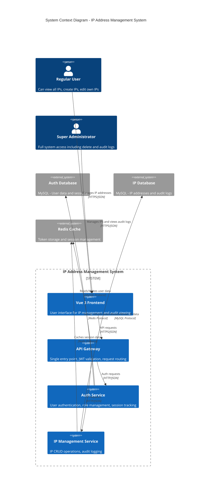

### 3.3 External Interfaces

| Interface | Protocol | Purpose | Security |
|-----------|----------|---------|----------|
| Browser to Frontend | HTTPS | User interface delivery | TLS encryption |
| Frontend to Gateway | HTTPS/JSON | API communication | JWT Bearer tokens |
| Gateway to Services | HTTP/JSON | Internal service calls | Internal network only |
| Services to Databases | MySQL Protocol | Data persistence | Network isolation |
| Services to Redis | Redis Protocol | Token/session storage | Network isolation |

---

## 4. Solution Strategy (arc42 Section 4)

### 4.1 Microservices Architecture Rationale

**Decision**: Use microservices architecture with 3 independent services

**Rationale**:
- **Separation of Concerns**: Auth, IP management, and gateway have distinct responsibilities
- **Independent Scaling**: Each service can be scaled based on load
- **Technology Flexibility**: Services can evolve independently
- **Fault Isolation**: Failure in one service doesn't cascade to others
- **Team Autonomy**: Aligns with modern development practices

**Trade-offs**:
- Increased operational complexity (mitigated by Docker Compose)
- Network latency between services (mitigated by co-location in Docker)
- Data consistency challenges (mitigated by clear service boundaries)

### 4.2 Technology Stack Decisions

| Layer | Technology | Justification |
|-------|------------|---------------|
| **Backend Framework** | Laravel 11 | Mature ecosystem, excellent ORM, built-in authentication patterns |
| **Frontend Framework** | Vue 3 + TypeScript | Reactive, component-based, type safety |
| **State Management** | Pinia | Vue 3 official recommendation, TypeScript support |
| **Authentication** | tymon/jwt-auth | Industry standard for Laravel JWT implementation |
| **Authorization** | spatie/laravel-permission | Battle-tested role/permission system |
| **Audit Logging** | spatie/laravel-activitylog | Comprehensive activity tracking |
| **IP Validation** | rlanvin/php-ip | Robust IPv4/IPv6 validation library |
| **Database** | MySQL 8.0 | ACID compliance, JSON support, proven reliability |
| **Caching** | Redis | In-memory performance, TTL support for tokens |
| **Containerization** | Docker + Docker Compose | Consistent environments, easy orchestration |

### 4.3 Security Approach

**Defense in Depth Strategy**:

1. **Transport Layer**: HTTPS for all external communication
2. **Authentication Layer**: JWT with short-lived access tokens (1 hour) and refresh tokens (7 days)
3. **Authorization Layer**: Role-based access control with Laravel Policies
4. **Application Layer**: Input validation, SQL injection prevention via Eloquent ORM
5. **Data Layer**: bcrypt password hashing, immutable audit logs
6. **Network Layer**: Docker internal networking, CORS configuration

---

## 5. Building Block View (arc42 Section 5 + C4 Level 2-3)

### 5.1 Container Diagram (C4 Level 2)

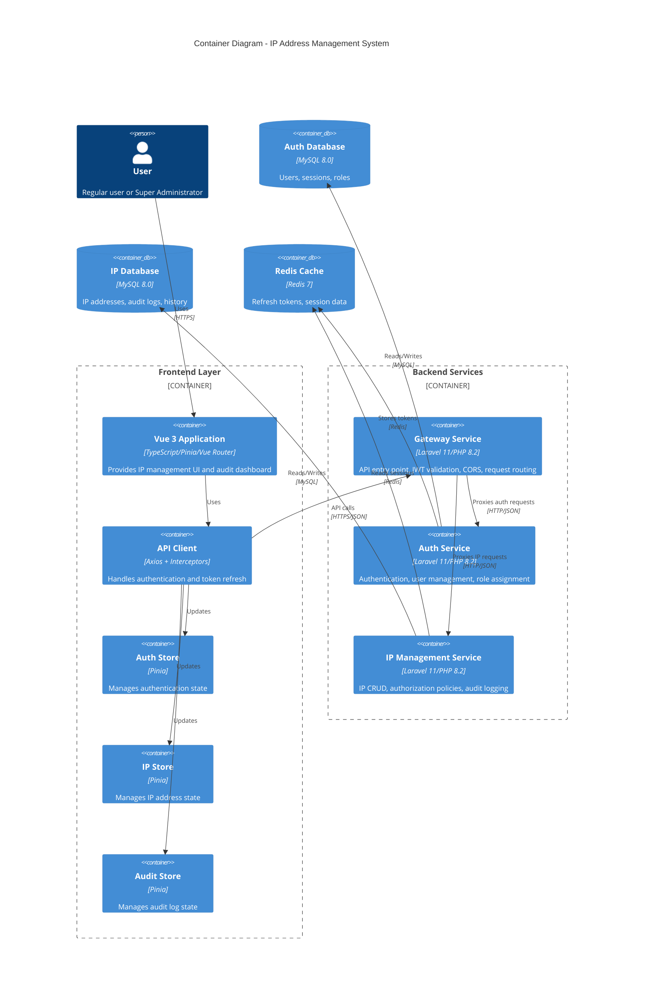

### 5.2 Gateway Service Components (C4 Level 3)

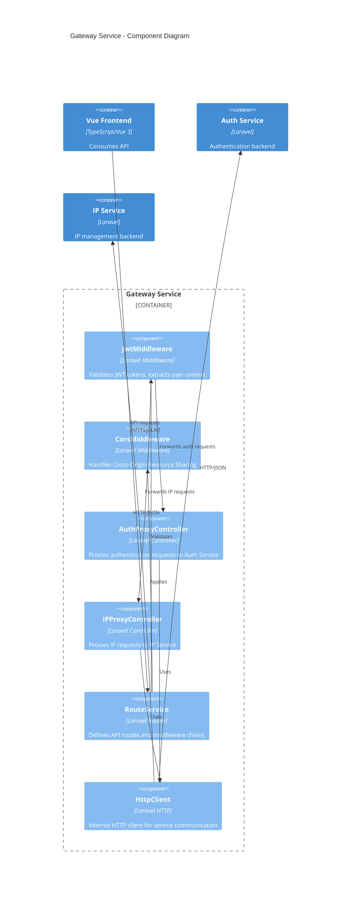

### 5.3 Auth Service Components (C4 Level 3)

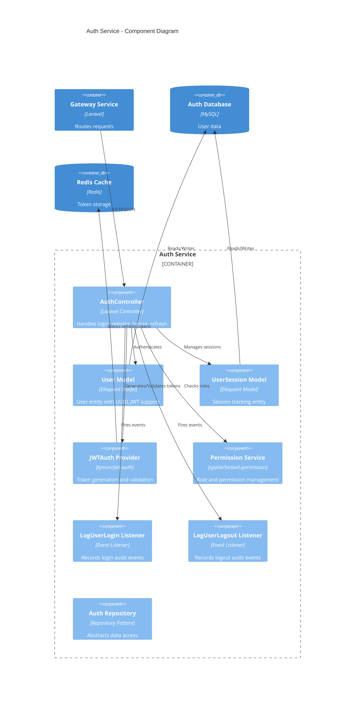

### 5.4 IP Management Service Components (C4 Level 3)

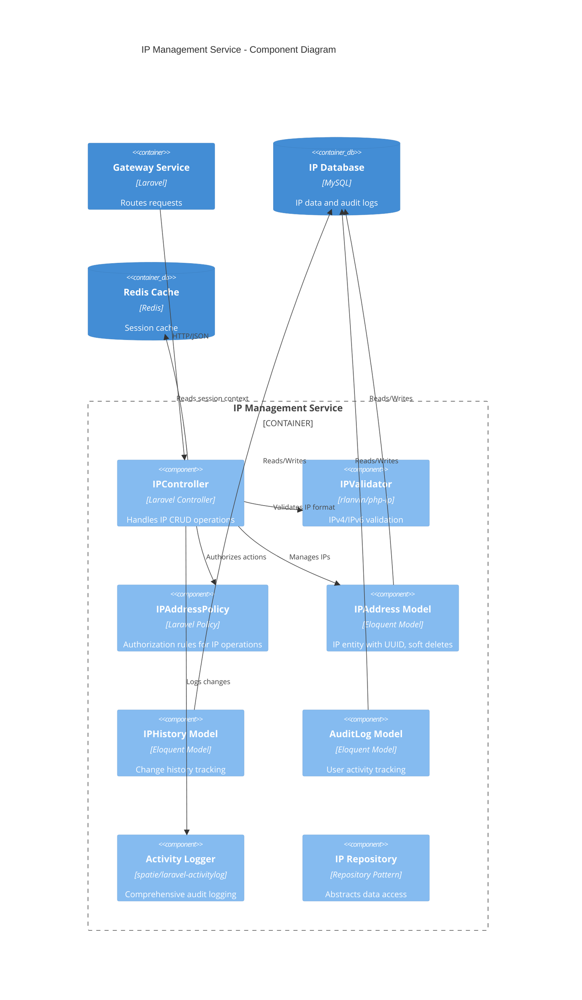

### 5.5 Data Flow Descriptions

#### 5.5.1 Authentication Flow

1. **Login Request**: Frontend → Gateway → Auth Service
2. **Token Generation**: Auth Service generates JWT access token (1h expiry) and refresh token (7d expiry)
3. **Token Storage**: Refresh token stored in Redis with user ID mapping
4. **Response**: Tokens returned to Frontend via Gateway
5. **Token Refresh**: Frontend uses refresh token to obtain new access token
6. **Logout**: Access token invalidated, refresh token removed from Redis

#### 5.5.2 IP Management Flow

1. **Create IP**: Gateway validates JWT → forwards to IP Service → validates IP format → stores in database → logs activity
2. **Update IP**: Gateway validates JWT → forwards to IP Service → policy checks ownership → updates database → logs change history
3. **Delete IP**: Gateway validates JWT → forwards to IP Service → policy checks super_admin role → soft delete → logs activity
4. **View History**: Gateway validates JWT → forwards to IP Service → retrieves audit trail from database

---

## 6. Runtime View (arc42 Section 6)

### 6.1 User Login with JWT Refresh Flow

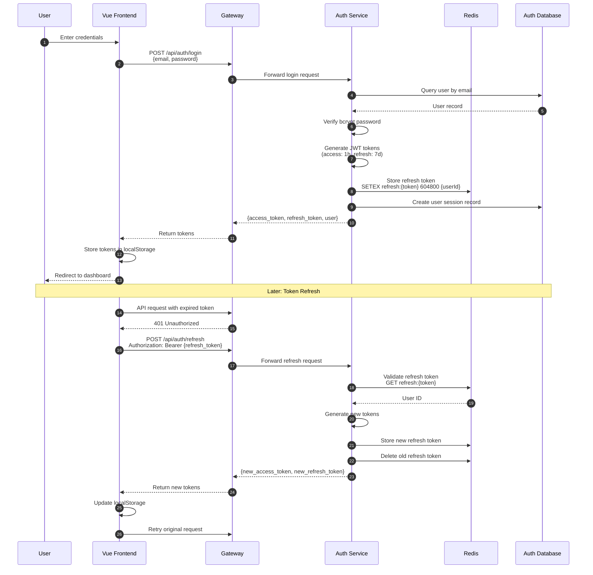

### 6.2 IP CRUD Operations with Audit Logging

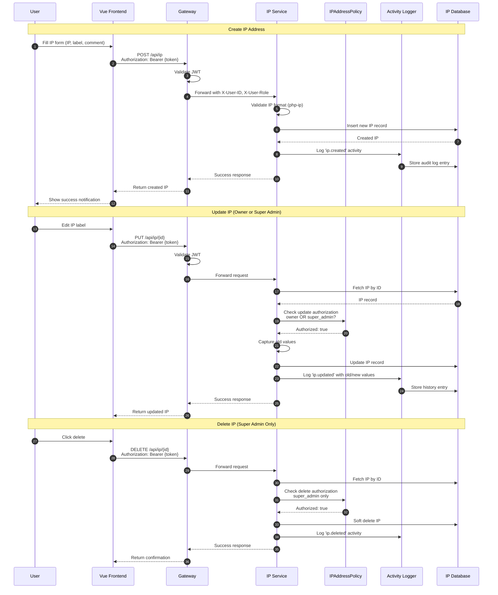

### 6.3 Gateway Proxy Request Handling

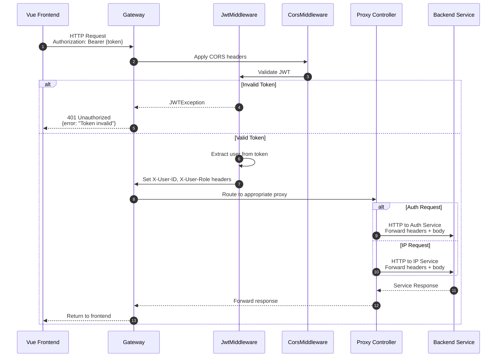

---

## 7. Deployment View (arc42 Section 7)

### 7.1 Docker Compose Architecture

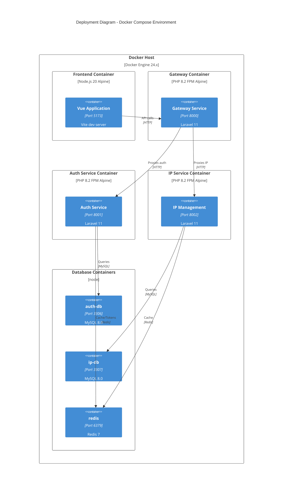

### 7.2 Network Topology

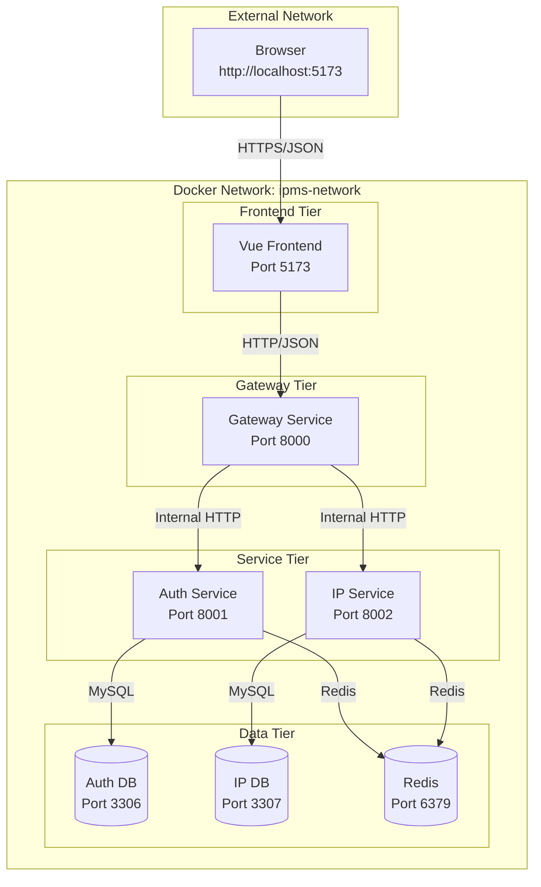

### 7.3 Port Mappings and Service Dependencies

| Service | Container Name | Internal Port | External Port | Dependencies |
|---------|---------------|---------------|---------------|--------------|
| Vue Frontend | frontend | 5173 | 5173 | None |
| Gateway | gateway | 8000 | 8000 | auth-service, ip-management |
| Auth Service | auth-service | 8000 | 8001 | auth-db, redis |
| IP Management | ip-management | 8000 | 8002 | ip-db, redis |
| Auth Database | auth-db | 3306 | 3306 | None |
| IP Database | ip-db | 3306 | 3307 | None |
| Redis Cache | redis | 6379 | 6379 | None |

### 7.4 Service Dependencies Graph

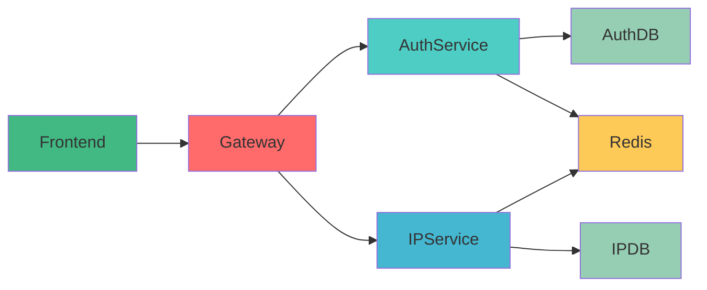

---

## 8. Data View (arc42 Section 8)

### 8.1 Auth Service Database Schema

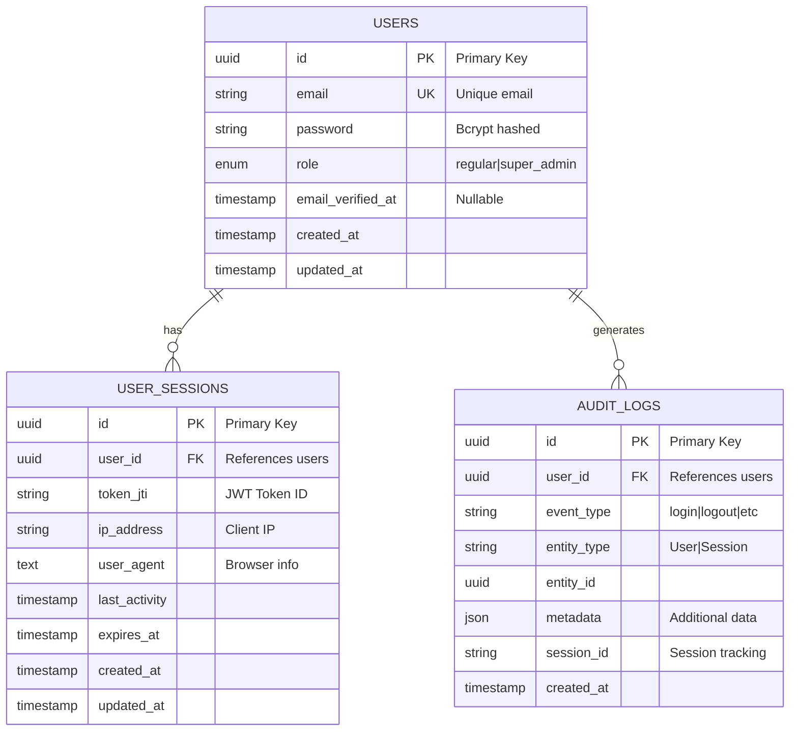

### 8.2 IP Management Service Database Schema

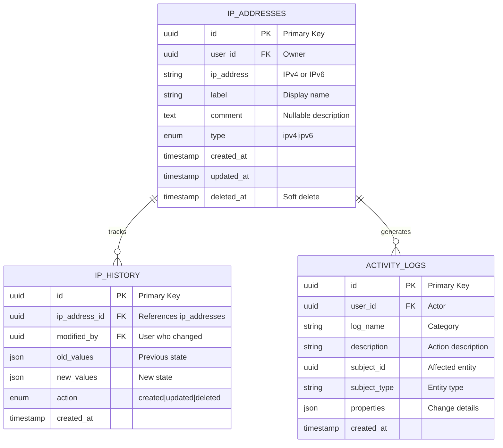

### 8.3 Entity Relationships

#### Auth Service Relationships

| Entity | Relationship | Target | Cardinality |
|--------|--------------|--------|-------------|
| User | has many | UserSessions | 1:N |
| User | has many | AuditLogs | 1:N |
| UserSession | belongs to | User | N:1 |
| AuditLog | belongs to | User | N:1 |

#### IP Management Service Relationships

| Entity | Relationship | Target | Cardinality |
|--------|--------------|--------|-------------|
| IPAddress | has many | IPHistory | 1:N |
| IPAddress | has many | ActivityLogs | 1:N |
| IPHistory | belongs to | IPAddress | N:1 |
| IPHistory | modified by | User (soft ref) | N:1 |
| ActivityLog | belongs to | User (soft ref) | N:1 |

### 8.4 Audit Log Data Model

**Immutable Audit Log Requirements (SEC-007):**

| Field | Type | Description | Compliance |
|-------|------|-------------|------------|
| id | UUID | Unique identifier | Primary key |
| user_id | UUID | Actor reference | Accountability |
| session_id | String | Session context | Session tracking |
| event_type | Enum | Event classification | Categorization |
| entity_type | String | Affected entity type | Scope |
| entity_id | UUID | Affected entity ID | Traceability |
| old_values | JSON | Previous state | Change tracking |
| new_values | JSON | New state | Change tracking |
| metadata | JSON | Additional context | Extensibility |
| created_at | Timestamp | When occurred | Chronology |

**No DELETE endpoint**: Audit logs are write-only and immutable per SEC-007.

---

## 9. Cross-cutting Concepts (arc42 Section 8)

### 9.1 JWT Authentication Strategy

**Token Structure:**

| Token Type | Expiry | Storage | Usage |
|------------|--------|---------|-------|
| Access Token | 1 hour | localStorage | API requests |
| Refresh Token | 7 days | Redis + localStorage | Token renewal |

**Token Flow:**

```mermaid
flowchart TD
    A[User Login] --> B[Generate Access Token]
    A --> C[Generate Refresh Token]
    C --> D[Store in Redis<br/>Key: refresh:{token}<br/>TTL: 7 days]
    B --> E[Return to Client]
    C --> E
    E --> F[Store in localStorage]
    
    G[API Request] --> H{Access Token Valid?}
    H -->|Yes| I[Process Request]
    H -->|No| J{Refresh Token Valid?}
    J -->|Yes| K[Generate New Tokens]
    K --> D
    K --> L[Update localStorage]
    J -->|No| M[Redirect to Login]
```

**Implementation:**
- Access token validated on every API request via Gateway [`JwtMiddleware`](services/gateway/app/Http/Middleware/JwtMiddleware.php)
- Refresh token rotation ensures security (old tokens invalidated after refresh)
- Redis storage enables distributed token validation across services

### 9.2 Role-Based Authorization

**Role Hierarchy:**

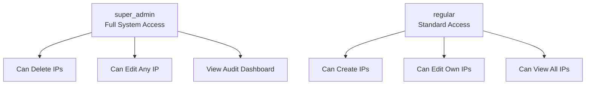

**Policy Implementation:**

| Action | Regular User | Super Admin |
|--------|--------------|-------------|
| View IPs | ✅ All IPs | ✅ All IPs |
| Create IP | ✅ Own IPs | ✅ Any IP |
| Update IP | ✅ Own only | ✅ Any IP |
| Delete IP | ❌ Not allowed | ✅ Any IP |
| View Audit | ❌ Not allowed | ✅ Full access |

**Laravel Policy Enforcement:**
```php
// IPAddressPolicy.php
public function update(User $user, IPAddress $ip): bool
{
    return $user->id === $ip->user_id || $user->hasRole('super_admin');
}

public function delete(User $user, IPAddress $ip): bool
{
    return $user->hasRole('super_admin');
}
```

### 9.3 Audit Logging Approach

**Event Types Tracked:**

| Category | Events | Storage |
|----------|--------|---------|
| Authentication | login, logout | audit_logs table |
| IP Management | created, updated, deleted | activity_logs table |
| IP History | Changes tracked | ip_history table |

**Session Tracking:**

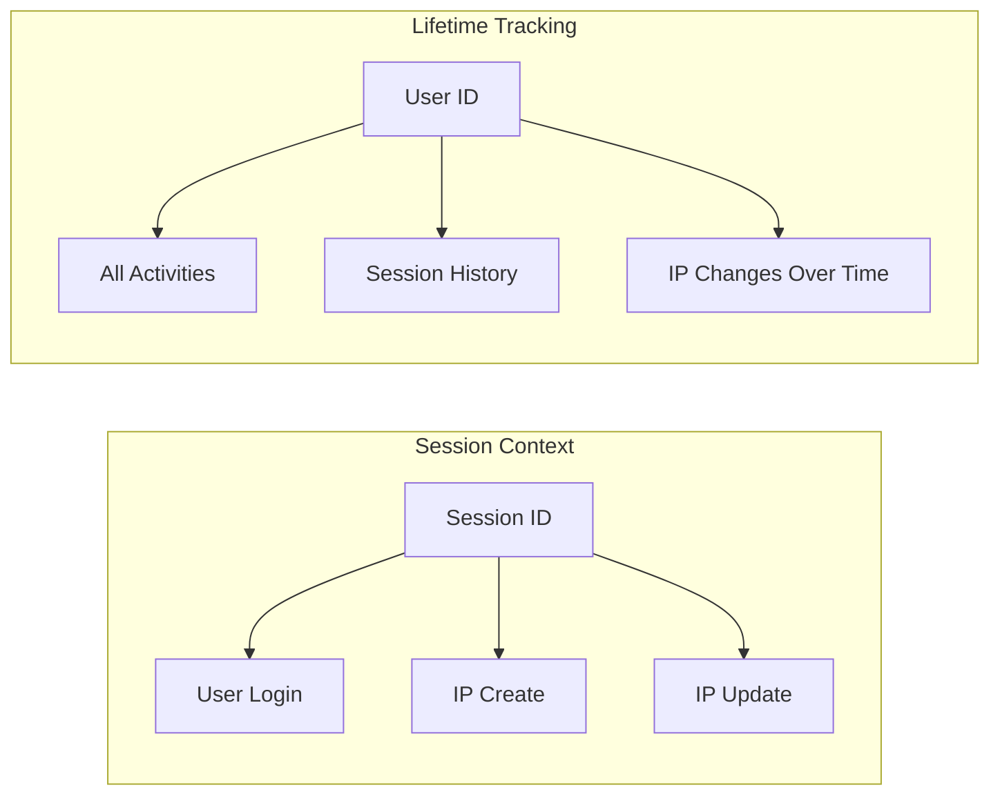

**Implementation:**
- Login/logout events via Laravel Event/Listener system
- IP changes via Spatie Activity Log trait
- Session ID stored in JWT claims for request correlation

### 9.4 Error Handling Strategy

**Error Response Format:**

```json
{
  "success": false,
  "error": {
    "code": "VALIDATION_ERROR",
    "message": "The given data was invalid.",
    "details": {
      "ip_address": ["The ip address field is required."]
    }
  },
  "meta": {
    "timestamp": "2026-02-01T12:00:00Z",
    "request_id": "uuid"
  }
}
```

**HTTP Status Codes:**

| Status | Usage |
|--------|-------|
| 200 OK | Successful GET, PUT |
| 201 Created | Successful POST |
| 204 No Content | Successful DELETE |
| 400 Bad Request | Validation errors |
| 401 Unauthorized | Invalid/missing token |
| 403 Forbidden | Policy violation |
| 404 Not Found | Resource not found |
| 500 Internal Error | Server errors |

**Frontend Error Handling:**
- Axios interceptors catch 401 for token refresh
- Toast notifications for user feedback
- Form-level validation error display

### 9.5 CORS Configuration

**CORS Policy (Gateway):**

```php
// config/cors.php
return [
    'paths' => ['api/*'],
    'allowed_methods' => ['*'],
    'allowed_origins' => [
        'http://localhost:5173',  // Vite dev server
        'http://localhost:3000',  // Alternative frontend
    ],
    'allowed_headers' => ['*'],
    'exposed_headers' => [],
    'max_age' => 0,
    'supports_credentials' => false,
];
```

**Security Considerations:**
- Origins explicitly whitelisted (not wildcard in production)
- Credentials not supported (JWT in headers)
- Preflight caching configured

---

## 10. Architecture Decisions (arc42 Section 9)

### ADR-001: Microservices Architecture Over Monolith

**Status**: Accepted  
**Date**: 2026-02-01  
**Deciders**: Architect, Designer (T1)

**Context**: The system needs to demonstrate modern architectural patterns while maintaining separation of concerns between authentication, IP management, and API gateway functionality.

**Decision**: Implement microservices architecture with 3 independent Laravel services (Gateway, Auth, IP Management).

**Consequences:**
- ✅ Independent deployment and scaling
- ✅ Clear service boundaries aligned with business capabilities
- ✅ Technology flexibility per service
- ✅ Fault isolation
- ❌ Increased operational complexity (mitigated by Docker Compose)
- ❌ Network overhead between services (mitigated by co-location)

**Related Risks**: RISK-003 (Docker networking), RISK-010 (Service dependencies)

**Related Tasks**: IPMS-1.5, IPMS-1.6

---

### ADR-002: JWT Over Session-Based Authentication

**Status**: Accepted  
**Date**: 2026-02-01  
**Deciders**: Architect, Designer (T1)

**Context**: The system requires stateless authentication suitable for microservices architecture and SPAs.

**Decision**: Use JWT (JSON Web Tokens) with access/refresh token pattern instead of server-side sessions.

**Consequences:**
- ✅ Stateless - no server session storage required
- ✅ Scalable - tokens validated without database lookup
- ✅ Cross-domain friendly
- ✅ Mobile/API ready
- ❌ Token size larger than session cookies
- ❌ Token revocation requires blacklist (handled via Redis TTL)

**Security Measures**:
- Short-lived access tokens (1 hour)
- Refresh token rotation
- Redis storage for refresh tokens with automatic expiry
- No sensitive data in JWT payload

**Related Risks**: RISK-002 (JWT refresh complexity)

**Related Tasks**: IPMS-2.3, IPMS-4.6

---

### ADR-003: Gateway Pattern Implementation

**Status**: Accepted  
**Date**: 2026-02-01  
**Deciders**: Architect, Designer (T1)

**Context**: Multiple backend services need unified API access point for the frontend.

**Decision**: Implement Gateway Service as single entry point handling JWT validation, CORS, and request routing to backend services.

**Consequences:**
- ✅ Single API endpoint for frontend
- ✅ Centralized JWT validation
- ✅ Simplified CORS management
- ✅ Service abstraction - backend changes don't affect frontend
- ❌ Additional network hop
- ❌ Gateway becomes potential bottleneck (mitigated by stateless design)

**Gateway Responsibilities**:
- JWT validation
- CORS handling
- Request routing/proxying
- Header forwarding (X-User-ID, X-User-Role)

**Related Risks**: RISK-006 (CORS configuration)

**Related Tasks**: IPMS-4.1, IPMS-4.2, IPMS-4.3

---

### ADR-004: Redis for Token Storage

**Status**: Accepted  
**Date**: 2026-02-01  
**Deciders**: Architect, Designer (T1)

**Context**: Refresh tokens need secure, fast storage with automatic expiry.

**Decision**: Use Redis for refresh token storage and session caching.

**Consequences:**
- ✅ In-memory performance (sub-millisecond access)
- ✅ Automatic TTL-based expiry
- ✅ Distributed access from multiple services
- ✅ Atomic operations for token rotation
- ❌ Additional infrastructure component
- ❌ Data loss on Redis failure (acceptable for ephemeral tokens)

**Storage Pattern**:
```
Key: refresh:{token_jti}
Value: {user_id}
TTL: 604800 seconds (7 days)
```

**Related Risks**: RISK-009 (Redis connection failures)

**Related Tasks**: IPMS-2.3, IPMS-4.6

---

### ADR-005: UUID for Primary Keys

**Status**: Accepted  
**Date**: 2026-02-01  
**Deciders**: Architect, Designer (T1)

**Context**: Microservices architecture requires globally unique identifiers without coordination.

**Decision**: Use UUID v4 for all primary keys across all databases.

**Consequences:**
- ✅ Globally unique without coordination
- ✅ No ID conflicts during data migration
- ✅ Non-sequential (security benefit)
- ✅ Enables distributed ID generation
- ❌ Larger storage (16 bytes vs 4/8 bytes)
- ❌ Slower index performance (acceptable for scale)

**Related Risks**: RISK-008 (Database migration conflicts)

**Related Tasks**: IPMS-2.1, IPMS-3.1

---

## 11. Quality Requirements (arc42 Section 10)

### 11.1 NFR Mapping to Architecture

#### Security Requirements (SEC-001 to SEC-007)

| NFR ID | Requirement | Architectural Solution | Verification |
|--------|-------------|------------------------|--------------|
| SEC-001 | bcrypt password hashing | Laravel default Hash facade with bcrypt driver | Password tests |
| SEC-002 | JWT expiration (1h/7d) | Configured in [`config/jwt.php`](services/auth-service/config/jwt.php) | Token TTL tests |
| SEC-003 | Redis token storage | [`Redis::setex()`](services/auth-service/app/Http/Controllers/AuthController.php) with TTL | Redis integration tests |
| SEC-004 | CORS configuration | [`config/cors.php`](services/gateway/config/cors.php) with explicit origins | CORS preflight tests |
| SEC-005 | SQL injection prevention | Eloquent ORM parameter binding throughout | Security scan |
| SEC-006 | XSS prevention | Input validation, output encoding | Penetration testing |
| SEC-007 | Immutable audit logs | No DELETE endpoints for audit tables; write-only | Policy enforcement tests |

#### Performance Requirements (PERF-001 to PERF-003)

| NFR ID | Requirement | Architectural Solution | Target |
|--------|-------------|------------------------|--------|
| PERF-001 | API response < 200ms | Redis caching; optimized queries; Laravel Octane ready | 95th percentile |
| PERF-002 | Page load < 3 seconds | Vite optimized builds; lazy loading; CDN ready | Initial load |
| PERF-003 | Concurrent users (5-10) | Stateless services; horizontal scaling ready | Docker Compose tested |

#### Maintainability Requirements (MAINT-001 to MAINT-005)

| NFR ID | Requirement | Architectural Solution | Enforcement |
|--------|-------------|------------------------|-------------|
| MAINT-001 | PSR standards | Laravel Pint configuration; CI checks | Automated linting |
| MAINT-002 | Feature test coverage | PHPUnit test suites per service | Coverage reports |
| MAINT-003 | TypeScript strict mode | [`tsconfig.json`](frontend/tsconfig.json) strict: true | Build-time checks |
| MAINT-004 | Separation of concerns | Repository pattern; Service layer; Controllers thin | Code review |
| MAINT-005 | Documentation | This TDD; inline PHPDoc; README | Documentation review |

#### Usability Requirements (USAB-001 to USAB-005)

| NFR ID | Requirement | Architectural Solution | Implementation |
|--------|-------------|------------------------|----------------|
| USAB-001 | Responsive design | Tailwind CSS breakpoints | Mobile-first CSS |
| USAB-002 | Toast notifications | [`vue-toastification`](frontend/) integration | Notification service |
| USAB-003 | Form validation | Laravel Request validation; VeeValidate frontend | Real-time validation |
| USAB-004 | Loading states | Pinia loading flags; skeleton screens | Async operation UX |
| USAB-005 | Empty states | Conditional rendering with empty illustrations | List components |

### 11.2 Security Architecture Detail

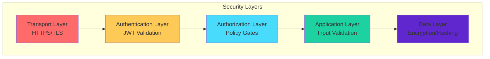

---

## 12. Risks & Technical Debt (arc42 Section 11)

### 12.1 Risk Register Reference

All risks are documented in [Risk Register](./risk_register.md). The following table maps risks to architectural mitigations:

| Risk ID | Risk Name | Score | Architectural Mitigation | Status |
|---------|-----------|-------|-------------------------|--------|
| RISK-001 | Aggressive Timeline | 9 - Critical | MVP feature prioritization; strict daily milestones | Active |
| RISK-002 | JWT Refresh Complexity | 6 - High | Proven library (tymon/jwt-auth); Day 2 focus; Redis TTL | Active |
| RISK-003 | Docker Networking Issues | 4 - Medium | Day 1 verification; service names; explicit networks | Active |
| RISK-004 | Scope Creep | 6 - High | Strict requirements checklist; defer non-essentials | Active |
| RISK-005 | Audit Log Complexity | 4 - Medium | Spatie Activity Log; phased implementation | Active |
| RISK-006 | CORS Configuration Issues | 4 - Medium | Early Day 4 configuration; explicit origins | Active |
| RISK-007 | TypeScript Strictness | 2 - Low | Comprehensive types Day 4; gradual strictness | Active |
| RISK-008 | Database Migration Conflicts | 3 - Medium | Separate databases; UUIDs; no cross-DB FKs | Active |
| RISK-009 | Redis Connection Failures | 2 - Low | Health checks; predis/predis; retry logic | Active |
| RISK-010 | Service Dependencies Blocking | 4 - Medium | Backend-first approach; API mocks for frontend | Active |

### 12.2 Architecture-Specific Risk Mitigations

#### RISK-001: Aggressive Timeline

**Architectural Response:**
- Simplified service boundaries (3 services vs. potential 4+)
- Reuse of proven packages (Spatie, tymon/jwt-auth)
- Pre-scaffolded Laravel structure provided
- Single database per service (no complex distributed transactions)

**Technical Debt Accepted:**
- Minimal test coverage (critical paths only)
- Basic UI styling (functional over polished)
- No advanced features (rate limiting, caching beyond Redis)

#### RISK-002: JWT Refresh Token Complexity

**Architectural Response:**
- Redis SETEX for automatic token expiry
- Token rotation on every refresh
- Graceful fallback to login on refresh failure
- Frontend interceptor handles 401 automatically

**Technical Debt:**
- No JWT blacklist for access tokens (short expiry mitigates)
- No sliding refresh (fixed 7-day expiry)

#### RISK-003: Docker Networking

**Architectural Response:**
- Explicit Docker network configuration
- Service name DNS resolution
- Health checks in docker-compose
- Port mapping documentation

### 12.3 Known Technical Debt

| Debt Item | Reason | Planned Resolution |
|-----------|--------|-------------------|
| No API versioning | MVP scope | Add /v1/ prefix for future versions |
| No rate limiting | Time constraint | Implement Laravel Throttle middleware |
| No comprehensive caching | Redis used only for tokens | Add query caching layer |
| No centralized logging | Single developer | Add ELK stack or CloudWatch |
| Basic test coverage | Time constraint | Expand test suites post-MVP |
| No CI/CD pipeline | Local development only | Add GitHub Actions |
| No monitoring/alerting | Local development only | Add Prometheus/Grafana |

---

## 13. Glossary (arc42 Section 12)

### 13.1 Technical Terms

| Term | Definition |
|------|------------|
| **Access Token** | Short-lived JWT (1 hour) used for API authentication |
| **ADR** | Architecture Decision Record - documents significant architectural decisions |
| **arc42** | Template for architecture documentation with 12 sections |
| **C4 Model** | Visual approach to documenting software architecture (Context, Containers, Components, Code) |
| **CORS** | Cross-Origin Resource Sharing - browser security mechanism |
| **Docker Compose** | Tool for defining and running multi-container applications |
| **Eloquent** | Laravel's ORM (Object-Relational Mapping) |
| **Gateway Pattern** | Single entry point for all client requests to backend services |
| **JWT** | JSON Web Token - compact, URL-safe means of representing claims |
| **Microservices** | Architectural style structuring application as loosely coupled services |
| **Pinia** | Vue 3 official state management library |
| **Policy** | Laravel authorization mechanism for resource-specific access control |
| **PSR** | PHP Standard Recommendation - coding standards |
| **Redis** | In-memory data structure store used for caching and session storage |
| **Refresh Token** | Long-lived token (7 days) used to obtain new access tokens |
| **Soft Delete** | Marking records as deleted without removing from database |
| **Spatie** | Belgian company providing high-quality Laravel packages |
| **Super Admin** | Role with full system access including delete operations |
| **TTL** | Time To Live - expiration time for cached data |
| **UUID** | Universally Unique Identifier - 128-bit identifier |
| **Vite** | Next-generation frontend build tool |
| **Vue 3** | Progressive JavaScript framework for building user interfaces |

### 13.2 Abbreviations

| Abbreviation | Full Form |
|--------------|-----------|
| API | Application Programming Interface |
| CRUD | Create, Read, Update, Delete |
| CORS | Cross-Origin Resource Sharing |
| FK | Foreign Key |
| HTTP | Hypertext Transfer Protocol |
| HTTPS | HTTP Secure |
| IP | Internet Protocol |
| IPMS | IP Management System |
| JWT | JSON Web Token |
| MVC | Model-View-Controller |
| NFR | Non-Functional Requirement |
| ORM | Object-Relational Mapping |
| PK | Primary Key |
| PSR | PHP Standard Recommendation |
| SPA | Single Page Application |
| SQL | Structured Query Language |
| SSL | Secure Sockets Layer |
| TLS | Transport Layer Security |
| TDD | Technical Design Document |
| TTL | Time To Live |
| UI | User Interface |
| UUID | Universally Unique Identifier |
| UX | User Experience |

### 13.3 Project-Specific Terms

| Term | Definition |
|------|------------|
| **Audit Log** | Immutable record of system activities including user actions |
| **Auth Service** | Microservice handling authentication, user management, roles |
| **Gateway Service** | Entry point microservice for routing and JWT validation |
| **IP Address** | Internet Protocol address (IPv4 or IPv6) managed by the system |
| **IP History** | Change tracking for IP address modifications over time |
| **IP Management Service** | Microservice handling IP CRUD operations and audit logging |
| **Regular User** | Standard role with limited permissions (create, edit own IPs) |
| **Super Administrator** | Elevated role with full permissions including delete and audit access |
| **User Session** | Tracked login session with metadata (IP, user agent, timestamps) |

---

## Appendix A: Implementation Task Traceability

### Task ID to Design Section Mapping

| Task ID | Task Name | Design Section | Component |
|---------|-----------|----------------|-----------|
| IPMS-1.1 | Gateway Package Installation | Section 5.3 | JwtMiddleware dependencies |
| IPMS-1.2 | Auth Package Installation | Section 5.3 | JWTAuth provider |
| IPMS-1.3 | IP Package Installation | Section 5.4 | Activity Log, php-ip |
| IPMS-1.4 | Frontend Dependencies | Section 5.1 | Pinia, Vue Router |
| IPMS-1.5 | Docker Compose | Section 7.1 | Deployment topology |
| IPMS-1.6 | DB Configuration | Section 8.1, 8.2 | Database schemas |
| IPMS-2.1 | User Migrations | Section 8.1 | Users, UserSessions |
| IPMS-2.2 | User Model & JWT Config | Section 9.1 | JWT Strategy |
| IPMS-2.3 | Auth Endpoints | Section 6.1 | Login Sequence |
| IPMS-2.4 | Role System | Section 9.2 | Authorization |
| IPMS-2.5 | Audit Events | Section 9.3 | Audit Logging |
| IPMS-2.6 | Auth Tests | Section 11.1 | SEC verification |
| IPMS-3.1 | IP Schema | Section 8.2 | IPAddresses, IPHistory |
| IPMS-3.2 | IP Models | Section 5.4 | Component diagram |
| IPMS-3.3 | IP CRUD | Section 6.2 | CRUD Sequence |
| IPMS-3.4 | Authorization Policies | Section 9.2 | Policy implementation |
| IPMS-3.5 | Audit Logging | Section 9.3 | Activity Log |
| IPMS-3.6 | IP Tests | Section 11.1 | NFR compliance |
| IPMS-4.1 | JWT Middleware | Section 5.3 | Gateway components |
| IPMS-4.2 | Proxy Controllers | Section 5.3 | Proxy pattern |
| IPMS-4.3 | Routes & CORS | Section 9.5 | CORS configuration |
| IPMS-4.4 | Frontend Dependencies | Section 5.1 | Frontend stack |
| IPMS-4.5 | TypeScript Types | Section 5.1 | Data contracts |
| IPMS-4.6 | API Client | Section 9.1 | Token refresh flow |
| IPMS-4.7 | Auth Store | Section 5.1 | Pinia stores |
| IPMS-5.1 | IP Store | Section 5.1 | State management |
| IPMS-5.2 | IP Views | Section 5.1 | Component architecture |
| IPMS-5.3 | Audit Dashboard | Section 9.2 | Role-based access |
| IPMS-5.4 | UI/UX Polish | Section 11.1 | Usability NFRs |
| IPMS-5.5 | Frontend Tests | Section 11.1 | MAINT-002 |
| IPMS-5.6 | Docker Optimization | Section 7.1 | Deployment |
| IPMS-5.7 | Documentation | All sections | This TDD |
| IPMS-5.8 | Final Review | Section 12 | Risk validation |

---

## Appendix B: NFR Compliance Checklist

### Security (SEC-001 to SEC-007)

- [x] SEC-001: bcrypt password hashing documented in Section 9.1
- [x] SEC-002: JWT expiration configured (1h access, 7d refresh) in Section 9.1
- [x] SEC-003: Redis token storage specified in ADR-004
- [x] SEC-004: CORS configuration detailed in Section 9.5
- [x] SEC-005: SQL injection prevention via Eloquent in Section 8
- [x] SEC-006: XSS prevention through input validation in Section 9.4
- [x] SEC-007: Immutable audit logs (no delete) in Section 8.4

### Performance (PERF-001 to PERF-003)

- [x] PERF-001: <200ms API response target in Section 11.1
- [x] PERF-002: <3s page load target in Section 11.1
- [x] PERF-003: 5-10 concurrent users supported in Section 7.1

### Maintainability (MAINT-001 to MAINT-005)

- [x] MAINT-001: PSR standards compliance in Section 11.1
- [x] MAINT-002: Feature test coverage in Section 11.1
- [x] MAINT-003: TypeScript strict mode in Section 11.1
- [x] MAINT-004: Separation of concerns in Section 5
- [x] MAINT-005: Documentation (this document)

### Usability (USAB-001 to USAB-005)

- [x] USAB-001: Responsive design in Section 11.1
- [x] USAB-002: Toast notifications in Section 11.1
- [x] USAB-003: Form validation in Section 11.1
- [x] USAB-004: Loading states in Section 11.1
- [x] USAB-005: Empty states in Section 11.1

---

## Document History

| Version | Date | Author | Changes |
|---------|------|--------|---------|
| 1.0 | 2026-02-01 | Designer (T1) | Initial comprehensive TDD creation with all arc42 sections and C4 diagrams |

---

**End of Technical Design Document**

*This document serves as the authoritative technical specification for the IP Address Management System implementation. All implementation tasks should reference this document for architectural guidance.*
